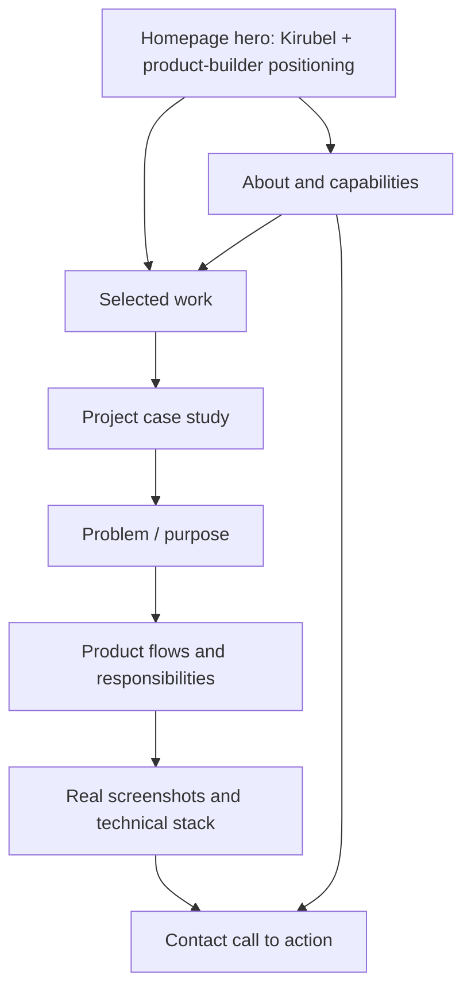

# App Flow

## Primary Visitor Journey

## Homepage Sequence

1. Navigation
2. Hero positioning and concise introduction
3. Selected product work
4. Builder-focused biography
5. Product and systems capabilities
6. Technology context where it supports the story
7. Contact call to action
8. Footer with confirmed links only

The exact section order may follow the existing template where doing so preserves its strongest pacing.

## Project Journey

1. Project title and concise product definition
2. Category, year/state, and confirmed live link if available
3. Product purpose or operational problem
4. Kirubel's responsibilities
5. Important workflows and features
6. Technical architecture or stack
7. Real product screenshots
8. Supported current state or outcome
9. Navigation to another approved project
10. Contact call to action

## Navigation Rules

- Home links return to meaningful homepage anchors.
- Work links resolve to `/work/`.
- Only the five approved project routes appear in cards or project navigation.
- Unconfirmed external links are hidden.
- The mobile menu must retain the template's existing interaction quality.

## Content Flow by Project

### Zewijuna

Mobile and web dating product; authentication, onboarding, discovery, filtering, profiles, realtime chat, membership, verification, Supabase-backed product logic, and build/deployment work.

### YourCloser

Telegram commerce automation SaaS; customer shopping flows, order lifecycle, admin operations, multi-tenant backend, plan enforcement, webhooks, and PostgreSQL/Supabase security.

### DMS

Dental management and clinic operations system; Admin, Reception, and Doctor workflows with role-based operational interfaces.

### Pommy

Content and flow remain provisional until the real local project is inspected.

### Majestic

Content and flow remain provisional until real project sources or deployments are located and inspected.

### DMS visual clarification

Use the user-supplied DentalCare admin dashboard screenshot as the primary DMS visual. It shows staff, services, patients, appointments, payments, quick actions, clinic metrics, and recent activity.
